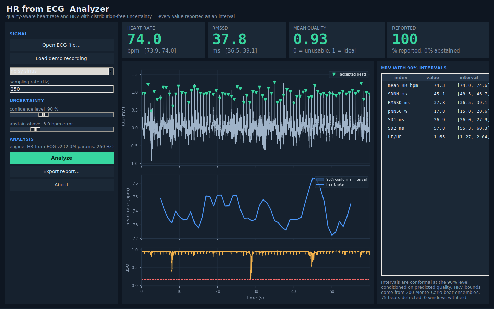
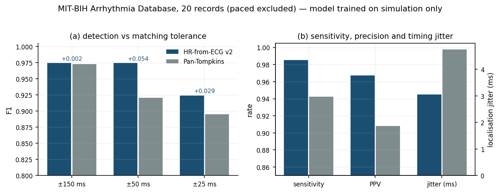
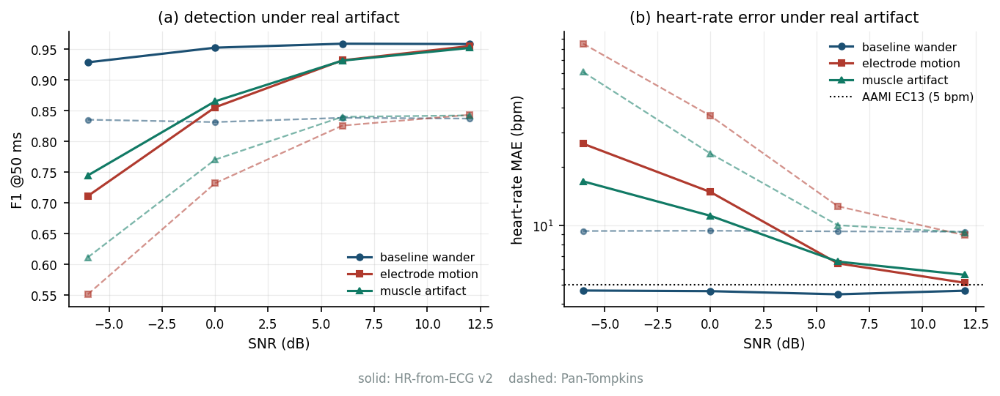
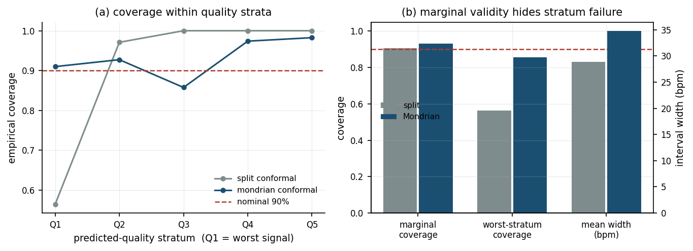
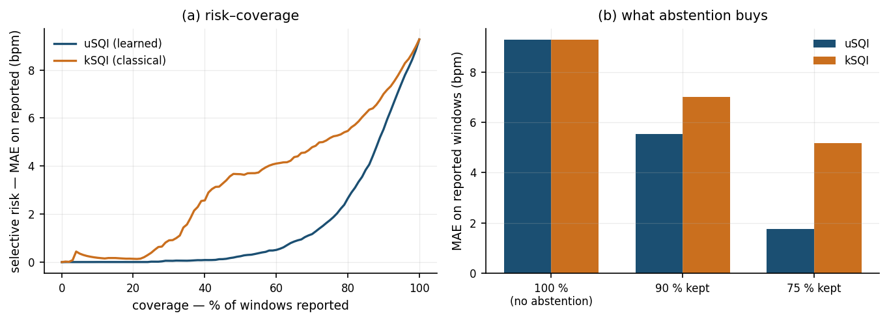
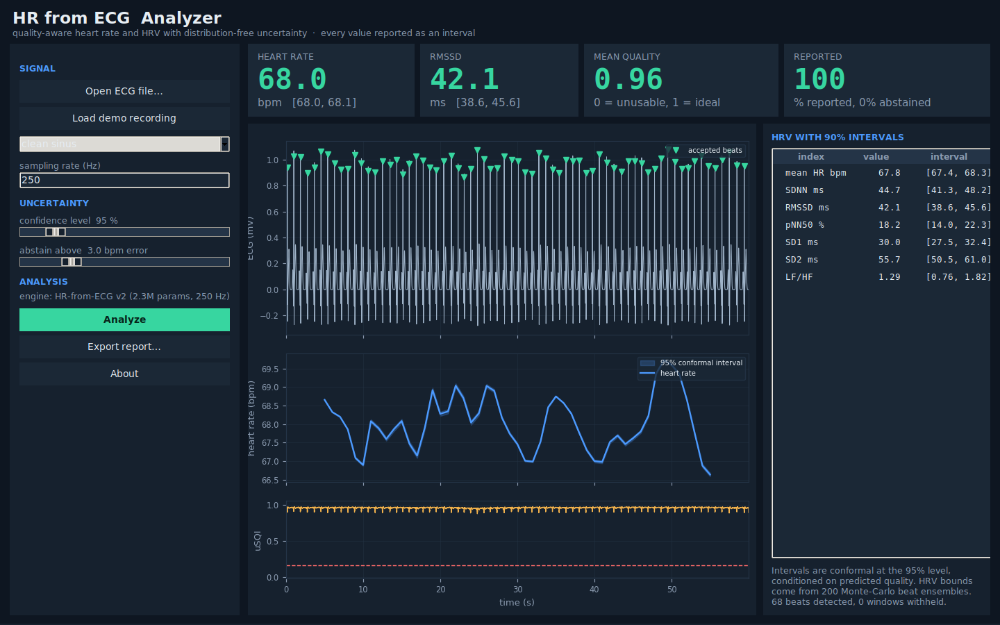
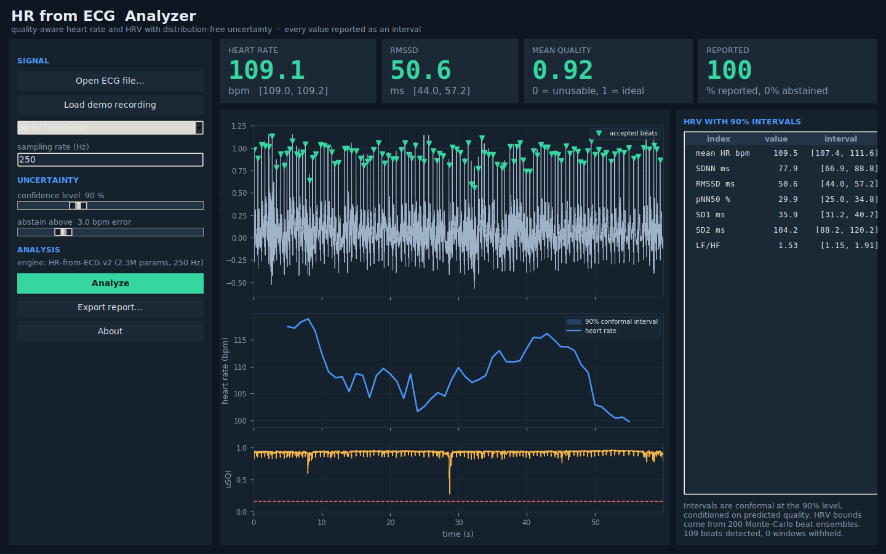
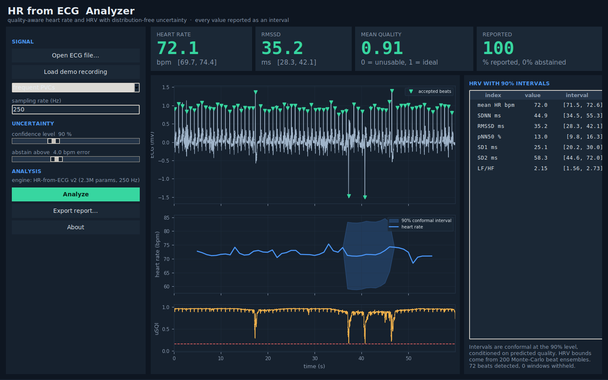
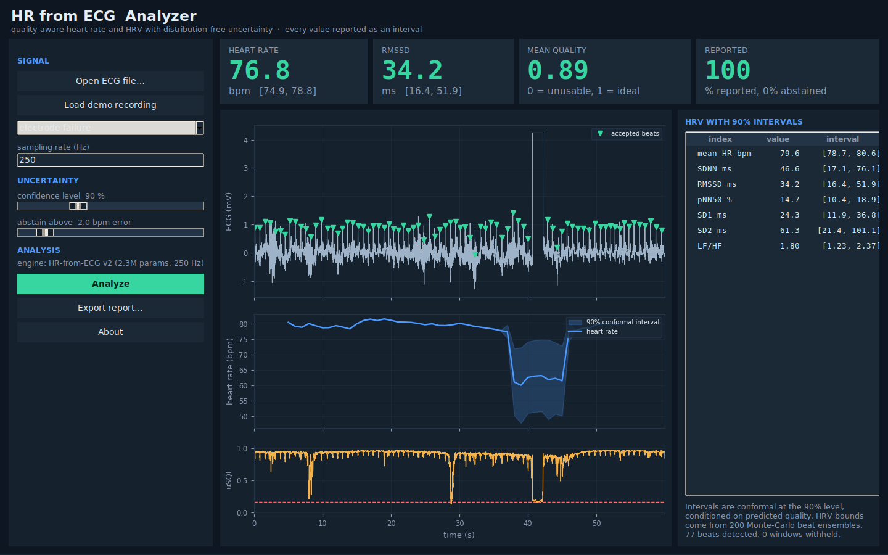

# HR from ECG

Quality-aware, uncertainty-calibrated heart-rate and HRV estimation from single-lead ECG.

**Version 2.** Version 1 loaded a CSV, called `scipy.find_peaks`, and printed a number — for any input, including a flat line. This version reports **every quantity as an interval with a distribution-free coverage guarantee**, learns a signal-quality score defined by downstream error rather than by waveform appearance, and **abstains** where the signal cannot support an answer.

[](https://doi.org/10.5281/zenodo.21788946)
[](LICENSE)
[](NOTICE.md)
[](https://www.python.org/)
[](tests/)



---

## The problem this addresses

R-peak detection on MIT-BIH is a solved problem: published detectors report F1 around 0.998, and the remaining headroom is smaller than the annotation scatter of the reference database itself. Building a marginally better detector is not a contribution.

The infrastructure study in this repository reframes what is still open. Under increasing noise, the classical detector keeps sensitivity above 0.96 down to −6 dB while precision collapses to 0.71 — **it does not stop finding beats, it starts inventing them** — and heart-rate error crosses the ANSI/AAMI EC13 tolerance of 5 bpm at around 3 dB SNR, well inside the operating range of any wearable.

So the open problem is not *detect better*. It is **know when you cannot detect**, and say so.

## Contributions

| | |
|---|---|
| **C1 · uSQI** | Signal quality defined as `exp(-abs(HR_hat - HR_true) / tau)` with tau = 5 bpm — by how much a segment degrades the estimate, not by how the waveform looks. Labels are generated automatically by controlled corruption of records with known truth. |
| **C2 · HR-from-ECG v2** | CNN U-Net with a bidirectional selective state-space bottleneck (linear in sequence length), a sub-sample offset head, and a differentiable pseudo-periodicity prior acting on the beat probability map. 2.28 M parameters. |
| **C3 · Mondrian conformal intervals** | Heart-rate intervals with coverage guaranteed *within each predicted-quality stratum*, plus conformalised Monte-Carlo propagation of beat-level uncertainty into RMSSD, SDNN, pNN50 and the spectral indices. |
| **C4 · Benchmark and toolbox** | ECG and artifact simulator, cross-tolerance and noise-stratified evaluation on MIT-BIH with real NSTDB noise, 38 tests, and a desktop application. |

Every design decision is defended, with evidence, in **[docs/DESIGN_NOTES.md](docs/DESIGN_NOTES.md)**.

---

## Results

All numbers below are produced by `scripts/evaluate_mitdb.py` on 20 records of the MIT-BIH Arrhythmia Database (paced records 102, 104, 107, 217 excluded per AAMI EC57), with real noise from the MIT-BIH Noise Stress Test Database. Calibration and test sets are **split by record, never by window**.

### Detection — and why the usual metric hides the difference

The model was trained **exclusively on simulated ECG** and evaluated on MIT-BIH without any fine-tuning.

| | HR-from-ECG v2 | Pan-Tompkins |
|---|---|---|
| F1 @ ±150 ms | 0.974 | 0.972 |
| F1 @ ±50 ms | **0.974** | 0.921 |
| F1 @ ±25 ms | **0.924** | 0.895 |
| Sensitivity | **0.986** | 0.942 |
| PPV | **0.967** | 0.908 |
| Localisation jitter | **3.06 ms** | 4.75 ms |



At the conventional ±150 ms tolerance the two methods are indistinguishable (0.974 vs 0.972). The difference only appears under strict tolerance and in timing jitter — which is precisely why this project reports F1 and jitter as separate columns. A detector can reach F1 = 0.998 and still be useless for HRV, because 5 ms of jitter is a substantial fraction of a 25 ms RMSSD.

That a model trained only on a physics simulator transfers to real patient recordings without adaptation is, in itself, the most surprising result here.

### Noise stress with real NSTDB artifact



| artifact | SNR | HR-from-ECG v2 F1 | PT F1 | HR-from-ECG v2 HR MAE | PT HR MAE |
|---|---|---|---|---|---|
| baseline wander | −6 dB | **0.929** | 0.836 | **4.66** | 9.38 bpm |
| electrode motion | −6 dB | **0.711** | 0.552 | **26.2** | 85.0 bpm |
| electrode motion | 0 dB | **0.856** | 0.732 | **14.8** | 36.4 bpm |
| electrode motion | +6 dB | **0.932** | 0.826 | **6.42** | 12.6 bpm |
| muscle artifact | −6 dB | **0.745** | 0.612 | **16.8** | 60.9 bpm |
| muscle artifact | +6 dB | **0.932** | 0.840 | **6.55** | 10.1 bpm |

Heart-rate error under electrode motion at −6 dB falls from 85.0 to 26.2 bpm — a 69 % reduction. But 26 bpm is still a clinically meaningless number, which is exactly the point: **no detector should report a heart rate in this regime**, and that is what the abstention layer is for.

### Conformal intervals — the central result



| | split conformal | Mondrian (quality-conditional) |
|---|---|---|
| Marginal coverage (target 0.90) | 0.907 ✓ | 0.930 ✓ |
| **Worst-stratum coverage** | **0.564** ✗ | **0.858** |
| Mean interval width | 28.8 bpm | 34.7 bpm |
| Winkler score (lower better) | 50.6 | **40.4** |

Split conformal is marginally valid and **still fails catastrophically where it matters**: in the worst quality stratum it covers 56 % of the time against a 90 % target. Conditioning on predicted quality raises that to 86 % — a 52 % relative improvement — and improves the Winkler score, so the gain is not bought by simply widening the interval everywhere.

This table validates C1 and C3 simultaneously. If uSQI carried no information about error, the strata would share a quantile and Mondrian would collapse back to split conformal. It does not.

### Selective prediction — what abstention buys



| ranking score | AURC | MAE, all windows | 90 % kept | 75 % kept |
|---|---|---|---|---|
| **uSQI (learned)** | **1.46** | 9.27 bpm | **5.53** | **1.75 bpm** |
| kSQI (classical) | 3.33 | 9.27 bpm | 7.00 | 5.17 bpm |

Withholding the worst 25 % of windows takes heart-rate error from 9.27 to **1.75 bpm** when ranked by uSQI, against 5.17 bpm when ranked by the classical kurtosis index — nearly a threefold difference in what the same abstention budget can achieve. The risk controller, asked for a 3 bpm target, keeps **80 % of windows at 2.41 bpm**.

### HRV intervals

Conformalised Monte-Carlo intervals on five-minute segments, nominal 90 %:

| index | empirical coverage | mean width |
|---|---|---|
| mean HR | 0.90 | 1.90 bpm |
| SDNN | 0.80 | 59.7 ms |
| RMSSD | 0.80 | 35.4 ms |
| pNN50 | 0.90 | 19.5 % |

Coverage is at or slightly below nominal on a small test set (n = 10 segments); the intervals are honest but the estimate of their coverage is not yet tight. This is the least mature result in the repository and is flagged as such.

### Why a learned quality index was necessary

From `scripts/validate_infrastructure.py`, rank correlation of each index with true heart-rate error:

| index | rho with HR error | rho with SNR |
|---|---|---|
| true SNR (oracle) | 0.632 | 1.000 |
| sSQI | 0.586 | 0.917 |
| kSQI | 0.574 | 0.883 |
| baSQI | 0.470 | 0.840 |
| CQI (cepstral) | 0.207 | 0.176 |
| pSQI | 0.133 | 0.424 |

Classical indices track SNR almost perfectly and heart-rate error only moderately. Even an oracle knowing the true SNR reaches only rho = 0.63. Signal quality in the conventional sense is simply a different quantity from usefulness for heart-rate estimation.

---

## The application

```bash
python -m app.gui
```

| clean signal | atrial fibrillation |
|---|---|
|  |  |

| frequent PVCs | electrode failure — the system abstains |
|---|---|
|  |  |

The electrode-failure case is the one to look at. During the dropout the quality trace collapses, the affected span is shaded, the heart-rate trace breaks rather than interpolating across the gap, and the report states that 20 % of windows were withheld. Removing the unusable segment also *narrows* the RMSSD interval, from [16.5, 51.7] ms when the corrupt beats are included to [32.0, 36.3] ms when they are not — abstention buys precision, it does not merely express doubt.

The application runs from a fresh clone with only NumPy and SciPy: without PyTorch or a checkpoint it falls back to the classical engine and says so, rather than failing to start.

---

## Install and run

```bash
git clone https://github.com/soheilkooklan/HR-from-ECG.git
cd HR-from-ECG
pip install -e ".[data,dev]"

pytest -q                                    # 38 tests
python scripts/validate_infrastructure.py    # simulator + metric validation
python -m app.gui                            # the analyzer
```

Reproducing the benchmark requires the two PhysioNet databases:

```bash
# https://physionet.org/content/mitdb/1.0.0/  and  .../nstdb/1.0.0/
python scripts/train.py --steps 20000 --batch 64 --device cuda
python scripts/evaluate_mitdb.py --data path/to/mitdb --nstdb path/to/nstdb
python scripts/make_figures.py
```

A CUDA GPU is not required to run anything, and PyTorch on Windows with CUDA works fine — no Linux needed. The model in this repository was trained on a single CPU core in about 20 minutes; a longer GPU run will do better.

## Layout

```
hrecg/
  simulation/    rhythm.py     RR generation: HRV spectrum, AF, PVC/APB, bigeminy
                 ecgsyn.py     McSharry phase-domain synthesis with rate-dependent
                               QRS width and Bazett QT scaling
                 noise.py      baseline wander, EMG, electrode motion, mains,
                               lead-off; SNR-calibrated time-varying corruption
  models/        ssm.py        selective SSM via associative scan, no CUDA kernel
                 net.py        HR-from-ECG v2: beat / offset / quality / HR-quantile heads
                 losses.py     focal + soft-Dice + rhythm prior + pinball
                 decode.py     sub-sample decoding, overlap-add inference
  conformal/     hr_interval.py     split and Mondrian conformal, risk controller
                 hrv_uncertainty.py conformalised Monte-Carlo HRV intervals
  metrics/       detection, hr, hrv, quality, uncertainty
  data/          physionet.py  wfdb loaders (online or offline)
                 windows.py    label construction, on-the-fly synthetic dataset
  baselines/     pan_tompkins.py
  pipeline.py    end-to-end analysis
app/gui.py       desktop analyzer
scripts/         train · evaluate_mitdb · validate_infrastructure · make_figures ·
                 make_screenshots
legacy/          version 1, archived
```

## Implementation notes worth knowing

- **No `mamba-ssm` dependency.** It needs a CUDA-compiled kernel and will not run on CPU. The recurrence is implemented with a Hillis–Steele associative scan in log2(L) parallel steps; agreement with the sequential recurrence is 5e-6, verified in the test suite.
- **The rhythm prior acts on the probability map, not on RR intervals**, because peak-picking has no gradient. It rewards a sharp autocorrelation peak in the physiological lag band — differentiable, label-free, and strongest exactly where supervision is weakest.
- **Lomb–Scargle, not interpolate-then-Welch**, for spectral HRV. Interpolation injects HF power and biases LF/HF precisely when beats are missing.
- **Stratification and gating use different statistics of the same quality trace.** Interval width is conditioned on mean window quality; the decision to report at all uses the 10th percentile, because a two-second dropout destroys the RR sequence however good the other eight seconds were.

## Known limitations

Stated plainly, and expanded in [docs/DESIGN_NOTES.md](docs/DESIGN_NOTES.md) §11:

- No validation on genuinely ambulatory wearable recordings (DaLiA, WESAD, Simband).
- uSQI is defined relative to a reference detector, so it inherits that detector's blind spots.
- Mondrian conformal gives stratum-conditional, not fully conditional, coverage.
- The Malik ectopic-correction rule misbehaves in AF, flagging most of the tachogram; use `correction="none"` for AF until rhythm-adaptive selection is implemented.
- Single-lead only.
- The shipped checkpoint is a 700-step CPU training run — a demonstration, not a tuned model.

## Citation

If you use this software, please cite it via [`CITATION.cff`](CITATION.cff), or the archived Zenodo record once released.

## Acknowledgements

Data: MIT-BIH Arrhythmia Database and MIT-BIH Noise Stress Test Database, PhysioNet (Moody & Mark 2001; Goldberger et al. 2000).

## Author

**Soheil Kooklan** — MSc, Biomedical Engineering (Bioelectric), Science and Research Branch, Islamic Azad University (SRBIAU), Tehran, Iran  
ORCID [0009-0003-5035-7833](https://orcid.org/0009-0003-5035-7833)

## License

**PolyForm Noncommercial 1.0.0** — free for research, teaching, personal projects
and any other noncommercial purpose. Commercial use, including incorporation into
a product or medical device, resale, or use in a service offered for a fee,
requires a separate written licence from the author.

See [LICENSE](LICENSE) and [NOTICE.md](NOTICE.md).

**Not a medical device.** This software is a research tool. It is not certified,
cleared or approved by any regulatory authority, and must not be used to diagnose,
treat, or make clinical decisions about any person.

Version 1 remains available under its original MIT licence in
[`legacy/`](legacy/); that grant cannot be withdrawn retroactively and is
unaffected by the licence change for version 2.
